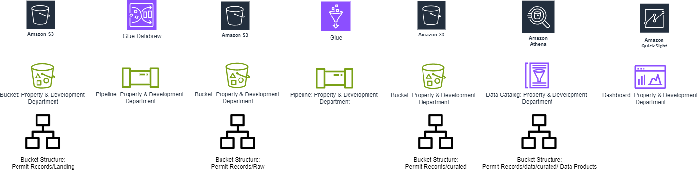
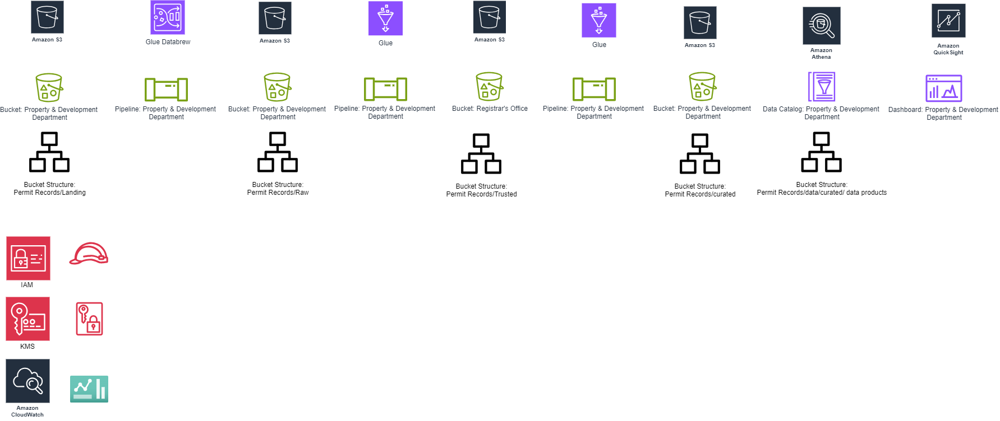

# Projects

Overview of my projects

### Table of Contents ###
- [Project 1: Exploratory Data Analysis Using AWS Services](#Project-1-Exploratory-Data-Analysis-Using-AWS-Services)
- [Project 2: Descriptive Analysis Using AWS Services](#Project-2-Descriptive-Analysis-Using-AWS-Services)
- [Project 3: Diagnostic Analysis Using AWS Services](#Project-3-Diagnostic-Analysis-Using-AWS-Services)
- [Project 4: Data Wrangling for University Enrollment Analysis Using AWS Services](#Project-4-Data-Wrangling-for-University-Enrollment-Analysis-Using-AWS-Services)
- [Project 5: Data Quality Control Analysis for City of Vancouver Building Permits](#Project-5-Data-Quality-Control-Analysis-for-City-of-Vancouver-Building-Permits)

--- 

## Project 1: Exploratory Data Analysis Using AWS Services

### Project Title: Enrollment and Withdrawal Trends Analysis at University Canada West Using AWS

#### Project Description: ####
This project aims to perform an exploratory data analysis (EDA) of the University's Enrollment and Withdrawal dataset using AWS services to uncover insights related to student enrollment patterns, program distribution, and retention rates. By leveraging AWS tools such as S3, AWS Glue, and Athena, we explore trends based on features like gender, academic programs, and enrollment status. This project demonstrates how cloud-based services streamline large-scale data analysis and visualization.

#### Dataset:
The dataset contains student information from the University of Canada West (UCW), with details such as:
- **StudentID**: Unique identifier for each student.
- **FirstName**: First name of the student.
- **LastName**: Last name of the student.
- **DateOfBirth**: Date of birth of the student.
- **Gender**: Gender of the student.
- **Program**: The academic program in which the student is enrolled.
- **EnrollmentDate**: The date when the student enrolled.
- **ExpectedGraduationDate**: The expected graduation date for the student.
- **Status**: Enrollment status (Enrolled, Graduated).
- **Email**: Contact email of the student.

#### Objective:
The objective is to analyze student enrollment and withdrawal patterns using AWS services, gaining insights into student demographics, program distribution, and factors influencing graduation and retention rates.

#### Methodology:

1. **Data Collection and Preparation**:
   - **Data Storage**: Upload the dataset to an Amazon S3 bucket for secure and scalable storage.
   - **Data Cleaning and Transformation**:
     - Use **AWS Glue** to create an ETL pipeline to clean the dataset, handle missing values, and format date columns (`DateOfBirth`, `EnrollmentDate`, `ExpectedGraduationDate`) for analysis.
     - Convert the data into a queryable format (e.g., Parquet) for optimized performance.
   - **AWS Glue Catalog**: Create a data catalog to manage metadata and make data easily discoverable for querying.

2. **Descriptive Statistics**:
   - Use **AWS Athena** to run SQL queries on the dataset stored in S3, generating summary statistics:
     - Calculate the average age of students based on `DateOfBirth`.
     - Count students per program and per enrollment status (Enrolled, Graduated).
     - Calculate the distribution of enrollment dates to observe academic cycles.

3. **Data Visualization**:
   - **Amazon QuickSight** for interactive data visualization:
     - **Bar Charts**: Display student counts across programs like MBA, MA, BA, and BCom, and visualize the enrollment status breakdown (Enrolled vs. Graduated).
     - **Pie Charts**: Visualize the gender distribution of students.
     - **Line Charts**: Plot enrollment trends over time, showing how many students enrolled in each semester.
     - **Stacked Bar Charts**: Explore program-wise gender distribution and their corresponding enrollment status to determine retention trends.

4. **Enrollment and Graduation Trends Analysis**:
   - Use **Athena** to compare enrollment and graduation rates across programs and genders:
     - **Program Trends**: Identify which programs (MBA, MA, BA) show higher graduation rates.
     - **Gender Analysis**: Analyze whether male or female students tend to graduate at higher rates.
     - **Year-over-Year Analysis**: Track how enrollment has changed over time, identifying any trends or anomalies.

5. **Insights and Findings**:
   - Summarize key insights based on the data exploration:
     - **Program-specific Analysis**: MBA and Leadership programs show high enrollment, while some programs may have lower graduation rates.
     - **Gender-based Patterns**: Gender distribution may show differences in enrollment trends.
     - **Enrollment Growth**: Year-over-year enrollment analysis may highlight academic cycles and potential areas for university outreach.

#### Tools and Technologies:
- **AWS S3** for data storage.
- **AWS Glue** for data cleaning, transformation, and cataloging.
- **AWS Athena** for SQL-based querying and analysis.
- **Amazon QuickSight** for creating interactive dashboards and data visualizations.

#### Deliverables:
- A comprehensive AWS Glue ETL pipeline documented in a Jupyter Notebook or **Glue Job** code.
- SQL queries used in **AWS Athena** to analyze the dataset.
- A presentation summarizing the insights and findings for university stakeholders or peers.

--- 

## Project 2: Descriptive Analysis Using AWS Services

### Project Title: Descriptive Analysis of City of Vancouver Issued Building Permits in the Downtown Region (2023-2024) Using AWS

#### Project Overview:
This project focuses on analyzing building permits issued in Vancouver's downtown region during the years 2023 and 2024. The goal is to gain insights into the types of construction projects, timelines for permit issuance, project values, and trends influencing urban development in the city. The project leverages AWS services such as S3 for data storage, Glue for ETL processes, Athena for querying, and QuickSight for data visualization.

#### Key Features of the Dataset:
- **PermitNumber**: Unique identifier for each building permit.
- **PermitNumberCreatedDate**: Date the permit number was generated.
- **IssueDate**: Date the permit was officially issued.
- **PermitElapsedDays**: Time (in days) between permit creation and issuance.
- **ProjectValue**: Monetary value of the construction project.
- **TypeOfWork**: Type of construction work (e.g., Addition, Alteration, New Construction).
- **Address**: Location of the construction site.
- **ProjectDescription**: Detailed description of the construction project.
- **PermitCategory**: Category of the building permit.
- **Applicant**: Individual or entity applying for the permit.
- **ApplicantAddress**: Address of the permit applicant.
- **PropertyUse**: Intended use of the property (e.g., Dwelling, Retail).
- **SpecificUseCategory**: Detailed property use category.
- **BuildingContractor**: Contractor responsible for the construction project.
- **IssueYear**: Year the permit was issued.
- **GeoLocalArea**: Geographical area within Vancouver.
- **YearMonth**: Year and month of permit issuance.
- **geo_point_2d**: Geospatial coordinates for mapping.

#### AWS Architecture:
##### 1. **Data Ingestion:**
- The dataset is ingested into **Amazon S3** in CSV format for secure and scalable storage.

##### 2. **Data Cleaning and Transformation:**
- **AWS Glue** is used to clean, transform, and categorize the data. Key transformations include:
  - Parsing date fields for better date-related analysis.
  - Calculating project timelines (permit elapsed days).
  - Categorizing the types of construction work, property use, and contractor activities.

##### 3. **Data Querying:**
- **Amazon Athena** is used to query the processed data. The following insights are derived through SQL queries:
  - Average project value categorized by property use type.
  - Analysis of permit processing time trends over time.
  - Identification of the most common types of construction work in Vancouver's downtown area.
  - Geographic distribution of high-value construction projects.

##### 4. **Data Visualization:**
- **AWS QuickSight** is employed to create interactive visualizations that help uncover trends and insights:
  - **Project Values Over Time**: A time series analysis showing fluctuations in project values across months and years.
  - **Geographic Heatmaps**: Displaying permit concentrations and high-value projects across different downtown neighborhoods.
  - **Permit Processing Times**: Visualizing permit approval timelines, revealing bottlenecks and efficiency trends in the process.

#### Insights & Findings:
- **Permit Trends**: Insights into the average time to issue permits, the types of work commonly requested, and the geographic areas with the most activity.
- **High-Value Projects**: Key findings around the distribution of high-value construction projects and their locations.
- **Construction Trends**: Understanding of the types of work that dominate downtown construction (e.g., additions, alterations).

#### Tools and Technologies:
- **Amazon S3**: For scalable data storage.
- **AWS Glue**: For ETL processes (data cleaning, transformation, and categorization) and Used **DataBrew** to clean and normalize data.
- **Amazon Athena**: For querying structured datasets.
- **AWS QuickSight**: For creating interactive dashboards and visualizations.

#### Deliverables:
- A detailed **report** summarizing insights, findings, and construction trends.
- **Visualizations** in AWS QuickSight showcasing key project trends and metrics.
- A **presentation** for stakeholders with visual dashboards to guide city planning and development strategy.

--- 

## Project 3: Diagnostic Analysis Using AWS Services

### Project Title: Diagnostic Analysis of City of Vancouver Issued Building Permits in the Downtown Region (2023-2024) Using AWS

#### Project Overview:
This project focuses on the diagnostic analysis of building permits issued in the downtown region of Vancouver during 2023 and 2024. The objective is to uncover insights into the types of work being performed, permit timelines, project values, and other key factors affecting construction trends in the city. The analysis is powered by AWS services like S3 for data storage, Glue for data cleaning and transformation, Athena for querying, and QuickSight for visualization.

#### Objective:
The primary goal of this project is to conduct a diagnostic analysis of building permits issued in the downtown region of Vancouver during 2023-2024. By analyzing various data points, including project values, permit processing timelines, types of construction work, and geographic distribution, we aim to uncover key trends and factors influencing construction activity. This analysis will provide actionable insights for urban planners and city officials to optimize permit processing, identify high-value projects, and support data-driven decisions for future urban development and planning in Vancouver.

#### Dataset Key Features:
- **PermitNumber:** Unique identifier for each building permit.
- **PermitNumberCreatedDate:** Date the permit number was created.
- **IssueDate:** Date the permit was issued.
- **PermitElapsedDays:** Days between permit creation and issuance.
- **ProjectValue:** Value of the project covered by the permit.
- **TypeOfWork:** Type of construction work (e.g., Addition, Alteration).
- **Address:** Location of the building.
- **ProjectDescription:** Detailed description of the construction work.
- **PermitCategory:** Category of the permit.
- **Applicant:** Individual/entity applying for the permit.
- **ApplicantAddress:** Address of the applicant.
- **PropertyUse:** Intended use of the property (e.g., Dwelling, Retail, Office).
- **SpecificUseCategory:** A more specific use category within PropertyUse.
- **BuildingContractor:** Contractor responsible for the project.
- **IssueYear:** Year the permit was issued.
- **GeoLocalArea:** Geographic area within the city.
- **YearMonth:** Year and month of permit issuance.
- **geo_point_2d:** Geospatial coordinates for mapping.

#### Methodology:

1. **Data Collection and Preparation:**
   - **Consolidation of Data:**
      - Building permits data for downtown Vancouver is sourced from multiple years (2023-2024) and stored in Amazon S3.
      - AWS Glue is used for data cleaning and transformation, ensuring all date fields (PermitCreatedDate, IssueDate) are properly formatted and missing             values are handled.
   - **Normalization:**
      - Data is normalized to ensure consistent formats for fields like property types, work categories, and permit categories, making it suitable for                analysis.
2. **Trend Analysis**:
   - **Sales Trends Analysis**:
       - Data Querying with Amazon Athena:
           - Secure Query Execution:
              - Use **IAM** policies to control who can run queries on Athena.
              - Ensure that query results are stored in encrypted S3 buckets.

        - Analysis Tasks
             - Query the data using Amazon Athena to analyze trends over time (month/year) for key metrics like:
               - Average Project Value by property type (Dwelling, Retail, Office).
               - Permit Processing Time trends based on categories like Type of Work (Addition, Alteration).
               - Geographic Trends by mapping permit concentration across downtown regions using geo_point_2d coordinates.
               - AWS QuickSight will visualize these trends using time series graphs and geographic heatmaps.
                 
3. **Correlation Analysis:**
   - **Sales Decline and Variables:**
     Analyze relationships between permit processing delays and variables such as:
      - ProjectValue to determine if higher value projects take longer to process.
      - Geographic area (GeoLocalArea) and the specific TypeOfWork to identify any regions or work types associated with delays.
      - Use statistical methods like regression analysis to quantify the strength of these relationships.
        
4. **Root Cause Analysis:**
   - **Investigating Permit Processing Delays:**
      - Conduct discussions or interviews (if possible) with city officials and contractors to gain qualitative insights into potential causes of delays.
      - Use structured techniques like the "5 Whys" or Fishbone Diagram to systematically explore potential root causes for processing delays and identify          areas for improvement in efficiency.
        
5. **Segmentation Analysis:**
   - **Customer Segmentation by Project Type:**
     Segment the data by project characteristics, such as:
      - Property use type (Dwelling, Retail, Office).
      - Work type (Addition, Alteration).
      - This segmentation will allow for a deeper understanding of how different types of projects are impacted by processing times or geographic location.
     
6. **Synthesis of Findings:**
   - **Quantitative and Qualitative Integration:**
      - Integrate findings from both quantitative (trend and correlation analysis) and qualitative (root cause) research to form a cohesive narrative on the       - key drivers of permit processing times and construction trends.
      - Highlight patterns and themes in the data that provide actionable insights for urban planners, city officials, and stakeholders.

### Monitoring and Logging

#### AWS CloudWatch:
- **Resource Monitoring:**
   - Monitor the performance of Glue jobs, Athena queries, and QuickSight dashboards.
   - Set up CloudWatch Alarms to notify the team of any unusual activity or errors.
- **Cost Management:**
   - Track the cost of AWS resources used in the project.
   - Set up billing alerts to stay within the project budget.

#### AWS CloudTrail:
- **Audit Logging:**
   - Record all API calls and user activities across AWS services.
   - Maintain logs of who accessed or modified data, which is essential for compliance and security audits.
- **Security Analysis:**
   - Use CloudTrail logs to detect unauthorized access attempts or suspicious activities.
   - Integrate with AWS Security Hub for advanced threat detection.

#### Project Insights and Trends:
- **Permit Processing Efficiency:**
  - Identified average permit processing times based on project types, uncovering potential delays in certain work categories.
  
- **Geospatial Trends:**
  - Heatmaps reveal high concentrations of large-scale projects in certain geographic areas within downtown Vancouver.

- **Financial Trends:**
  - Analysis of **ProjectValue** shows trends in construction spending, with spikes during specific months, often corresponding to infrastructure-related projects.

#### Challenges and Solutions:
- **Data Consistency Issues:** 
  - Variability in data entry (e.g., inconsistent date formats) was resolved through comprehensive data cleaning using AWS Glue.

- **Geospatial Data Visualization:**
  - Mapping permit locations required transforming and standardizing geospatial coordinates to ensure accurate plotting in QuickSight.

#### Tools and Technologies:
- **AWS S3**: For secure storage of the building permits dataset.
- **AWS Glue**: To perform ETL operations, including cleaning and transforming the data.
- **Amazon Athena**: For querying the dataset and generating insights.
- **AWS QuickSight**: To visualize trends and insights through dashboards.
- **IAM Roles**: To manage access control between services.
- **AWS KMS**: To encrypt sensitive data.
- **CloudTrail & CloudWatch**: For monitoring and auditing the environment.

#### Deliverables:
- **Comprehensive Data Analysis Report**: Summarizes findings, key metrics, and trends identified in the analysis.
- **Interactive Dashboards**: Includes visualizations of project values, geographic trends, and permit timelines.
- **Recommendations**: Actionable insights for the City of Vancouver on optimizing permit processing and identifying high-value construction trends.

#### Timeline:
- **Expected completion**: 6 weeks.
- Regular check-ins and status reports will be provided to ensure alignment with stakeholders' objectives and to address any emerging challenges.

--- 

## Project 4: Data Wrangling for University Enrollment Analysis Using AWS Services

### Project Title: Data Wrangling of City of Vancouver Issued Building Permits in the Downtown Region (2023-2024) Using AWS

#### **Project Overview:**
This project involves performing data wrangling on a dataset of student enrollments at the University. The goal is to clean, transform, and consolidate the student data for enhanced analysis and reporting. The analysis uses AWS services such as S3 for data storage, Glue for ETL, and Athena for querying the data. The wrangled dataset will be used to gain insights into student enrollment trends, graduation timelines, and program distribution, aiding the university in decision-making processes.

#### Objective:
The primary objective of this project is to perform comprehensive data wrangling on the university’s enrollment dataset. By cleaning and transforming the data, the goal is to improve its usability and accuracy, enabling further descriptive analysis of enrollment patterns, graduation rates, and student demographics. It aims to transform raw data into actionable insights that can inform university administration about key academic metrics.

#### Dataset Key Features:
- **StudentID:** Unique identifier for each student.
- **FirstName, LastName:** Names of the students.
- **DateOfBirth:** Birthdate of the students.
- **Gender:** Gender of the students.
- **Program:** The academic program in which the student is enrolled.
- **EnrollmentDate:** Date of student enrollment.
- **ExpectedGraduationDate:** The anticipated graduation date.
- **Status:** Current enrollment status (Enrolled or Graduated).
- **Email:** Contact email of the students.

#### AWS Architecture:

##### Data Ingestion:
- The student enrollment data is ingested into **Amazon S3** in CSV format for storage.

##### Data Cleaning and Transformation:
- **AWS Glue** is used to clean and transform the data:
    - Parse date fields such as `DateOfBirth`, `EnrollmentDate`, and `ExpectedGraduationDate`.
    - Standardize gender entries (e.g., "M/F").
    - Calculate additional metrics like the number of days from enrollment to expected graduation.
    - Address missing data (if any) and normalize categorical variables like `Status` (e.g., "Enrolled", "Graduated").

##### Data Querying:
- **Amazon Athena** is utilized for querying the cleaned dataset. Some of the queries include:
    - Distribution of students across different programs.
    - Graduation timelines and trends based on the `ExpectedGraduationDate`.
    - Breakdown of enrollment status by program and year.

##### Data Visualization:
- **AWS QuickSight** is used to visualize:
    - Enrollment trends by year and program.
    - Gender distribution across different academic programs.
    - Average time to graduation per program.
    - Dashboard visualizations for tracking student enrollment and graduation rates over time.

#### Methodology:

1. **Discover**
   - **Understanding the Data**: Conducted an initial assessment to comprehend the structure, data types, and content of the dataset. Key features include StudentID, Name, DateOfBirth, Gender, Program, EnrollmentDate, GraduationDate, and Status.
   - **Exploratory Data Analysis (EDA)**: Identified missing values, anomalies, and outliers to understand data quality and distribution.
2. **Structure**
   - **Organize Data**: Defined schemas and data types for each field in the dataset, ensuring that dates, numerical fields, and categorical variables were properly formatted.
   - **Format Data**: Standardized formats for dates and categorical variables, particularly focusing on consistency in fields such as EnrollmentDate, GraduationDate, and Program.
3. **Clean**
   - **Handle Missing Values**: Used imputation techniques for non-essential fields or removed records with missing essential fields.
   - **Remove Duplicates**: Eliminated duplicate entries based on StudentID.
   - **Correct Errors**: Corrected inconsistencies in data entries, including typos in Program names and inaccurate Status fields.
4. **Enrich**
   - **Feature Engineering**:
      - Calculated EnrollmentDuration by finding the difference between EnrollmentDate and GraduationDate.
      - Derived Age from DateOfBirth.
      - Standardized categorical variables by normalizing entries in Gender, Status, and Program.
5. **Validate**
   - **Data Consistency Checks**: Ensured logical consistency, such as validating that EnrollmentDate precedes GraduationDate.
   - **Quality Assurance**: Conducted quality checks to verify that the data transformations preserved integrity and accuracy.
6. **Publish**
   - **Curated Dataset**: Saved the cleaned and enriched dataset back to AWS S3 in a designated curated zone for further analysis.
   - **Documentation**: Recorded all data wrangling steps, decisions, and insights in a structured format for transparency and reproducibility.

#### Tools and Technologies:
- **AWS S3**: For data storage and retrieval.
- **AWS Glue**: For data cleaning, transformation, and ETL operations.
- **Amazon Athena**: For querying the dataset.
- **AWS QuickSight**: For creating interactive dashboards and visualizations.
- **AWS EC2**: For scalable and customizable compute resources to process the dataset.
- **AWS VPC**: To create a secure and isolated environment to run the EC2 instances.

#### Deliverables:
- **Cleaned Dataset**: A well-structured dataset in CSV format that has been cleaned and transformed for further analysis.
- **Data Wrangling Report**: Documentation of the data wrangling process, including methods used to clean and transform the dataset, challenges encountered, and data validation results.
- **Visualizations**: Interactive dashboards built in AWS QuickSight that highlight key insights such as enrollment trends, gender distribution, and time-to-graduation.

#### Timeline:
- Week 1-2: Data ingestion and initial discovery phase.
- Week 3: Data structuring and cleaning using AWS Glue.
- Week 4: Data enrichment and validation.
- Week 5: Data analysis with Amazon Athena.
- Week 6: Visualization development in AWS QuickSight.
- Week 7: Compilation of documentation and final reports.
- Week 8: Presentation of findings and project handover.

This data wrangling project ensures the preparation of a high-quality dataset that enables the university to conduct detailed analysis of enrollment patterns, helping improve student retention strategies, optimize academic offerings, and enhance overall operational efficiency.

--- 

## Project 5: Data Quality Control Analysis for City of Vancouver Building Permits

### Project Title: Data Quality Control Analysis of Vancouver Downtown Building Permits Using AWS Services

#### Project Overview:
This project involves analyzing building permits issued in Vancouver's downtown region from 2023 to 2024. The dataset includes information such as project value, type of work, contractor information, permit processing time, and geographic coordinates. The goal is to gain insights to support urban development strategies and improve permit processing efficiency.

#### Objectives:
- Perform ETL (Extract, Transform, Load) on the dataset using AWS services.
- Visualize trends and patterns related to building permits (e.g., project types, values, timelines).
- Analyze geographic data to understand the distribution of permit types across downtown Vancouver.

#### 1. Data Ingestion:
- **City of Vancouver Open Data Catalogue.**
- Dataset uploaded to AWS S3 in CSV format.

##### Dataset Fields:
- `PermitNumber`: Unique identifier for each permit.
- `PermitNumberCreatedDate`: Date the permit number was created.
- `IssueDate`: Date the permit was issued.
- `PermitElapsedDays`: Time between creation and issuance.
- `ProjectValue`: Value of the project in CAD.
- `TypeOfWork`: Type of construction or alteration work.
- `Address`: Project location.
- `ProjectDescription`: Detailed description of the project.
- `PermitCategory`: Classification (e.g., Residential, Commercial).
- `Applicant`: Name of the permit applicant.
- `ApplicantAddress`: Address of the applicant.
- `PropertyUse`: Usage type of the property (e.g., Dwelling, Commercial).
- `SpecificUseCategory`: Specific use type (e.g., Retail Store, Restaurant).
- `BuildingContractor`: Name of the contractor.
- `BuildingContractorAddress`: Contractor's address.
- `IssueYear`: Year the permit was issued.
- `GeoLocalArea`: Geographical area of the project within Vancouver.
- `Geom`: Geographic coordinates of the building (lat-long).
- `YearMonth`: Year and month of permit issuance.
- `geo_point_2d`: Latitude and longitude in plain text.

#### 2. Data Transformation (ETL):
##### AWS Glue ETL Pipeline:
- **Extract**: Load the dataset from AWS S3.
- **Transform**:
  - Clean missing or erroneous values.
  - **Sensitive Data Handling**: In the ETL pipeline created using AWS Glue, part of the transformation process will focus on data governance principles by detecting and eliminating sensitive data related 
    to Canada's Personal Identifiable Information (PII). This ensures compliance with data privacy regulations such as PIPEDA (Personal Information Protection and Electronic Documents Act).
  - Calculate additional fields such as `Permit Processing Time` (from `PermitElapsedDays`).
  - **Data Quality Control**: The ETL process also incorporates checks to ensure the data quality meets the following standards:
      - **Completeness**: Ensuring more than 95% of the data is available (e.g., no null or missing fields for key attributes such as PermitNumber, ProjectValue).
      - **Uniqueness**: Checking for duplicates to maintain more than 80% uniqueness (e.g., ensuring there are no duplicate PermitNumbers).
      - **Freshness**: Verifying that the data is recent, particularly for ongoing projects (e.g., ensuring PermitElapsedDays is up to date).
      - **Valid Value Checks**: Ensuring data consistency (e.g., PermitCategory should only contain predefined categories like "Residential" or "Commercial").
- **Load**: Store the transformed dataset back into AWS S3 Trusted Zone for analysis.
- **Scheduled ETL**: The ETL job is scheduled to run weekly on Sundays at 11:59 PM, ensuring that the dataset is regularly updated and refreshed in AWS S3. The job is part of an automated workflow 
    triggered on a weekly basis, keeping the data analysis up-to-date.

#### 3. Data Analysis:
Queries in AWS Athena were designed to explore different dimensions of the dataset, such as:
- **Average Permit Processing Time** by type of work.
- **Top 10 Most Expensive Projects**.
- **Distribution of Permit Categories** (e.g., Commercial, Residential).
- **Geographic Distribution** of permits across downtown Vancouver.

#### 4. Data Monitoring & Controlling:
##### 1. AWS CloudWatch:

- Activity Tracking: CloudWatch is used to monitor the ETL job's execution and track the activities related to the project, such as job success/failure, run times, and user interactions.
- Cost Monitoring: An alarm is set to trigger if the overall budget for the project exceeds $45. This ensures cost efficiency and prevents unexpected billing surprises when using AWS services like Glue, Athena, and QuickSight.
- Dashboard Creation: A dashboard is created to visualize various project activities, such as job success rates, data ingestion trends, and costs over time. This allows for real-time monitoring and control.

##### 2. AWS CloudTrail:
- CloudTrail logs are used to track user activities, providing an audit trail of who accessed or modified the dataset. This is crucial for governance and accountability, especially in a multi-user project   environment.

#### 5. Data Visualization:

##### 1. Permit Processing Time by Project Type:
   - **Visualization Tool**: AWS QuickSight / Tableau
   - **Type of Visualization**: Bar Chart
   - **Description**: 
     - This bar chart presents the **average time** taken to issue permits for different types of work (e.g., Residential, Commercial, Industrial).
     - It provides a comparative view of processing times, helping identify which project types experience longer delays.
  
##### 2. Geographic Distribution of Permits
   - **Visualization Tool**: AWS QuickSight / Tableau
   - **Type of Visualization**: Map
   - **Description**:
     - A map was created to **visualize the geographical distribution** of building permits across downtown Vancouver.
     - The map is **color-coded** to distinguish between various permit categories such as **residential**, **commercial**, and **other types of permits**.
     - This visualization highlights areas with high development activity, offering a clear view of where major construction projects are concentrated within the downtown region.
     - This tool enables stakeholders to better understand urban development trends and identify zones of higher development density.

##### 3. Top 10 Projects by Value
   - **Visualization Tool**: AWS QuickSight / Tableau
   - **Type of Visualization**: Pie Chart
   - **Description**:
     - A **pie chart** was used to present the **top 10 most expensive projects** based on their project value in Canadian dollars (CAD).
     - Each slice of the pie chart represents a high-value project, providing a comparative view of the **largest financial investments** in downtown Vancouver's construction activities.
     - This visualization helps in identifying the **major developments** in the region and where substantial resources are being allocated, giving insights into the most significant projects shaping Vancouver’s urban landscape.

##### 4. Trends in Permit Issuance
   - **Visualization Tool**: AWS QuickSight / Tableau
   - **Type of Visualization**: Line Chart
   - **Description**:
     - A **line chart** was developed to visualize the **trends in building permit issuance** over time, with data broken down by month and year.
     - The chart highlights **fluctuations in permit issuance**, allowing for the observation of seasonal patterns or potential **impacts of city policies** on the frequency of permit applications.
     - This visualization is key in understanding the rhythm of urban development and identifying **periods of higher or lower construction activity**, which can inform future urban planning and resource allocation.

#### Tools and Technologies:
- **AWS S3**: Store raw and processed data.
- **AWS Glue**: ETL pipeline for data extraction and transformation.
- **AWS Athena**: Query transformed data.
- **AWS QuickSight**: Visualize the data.
- **AWS EC2**: For scalable and customizable compute resources to process the dataset.
- **AWS VPC**: To create a secure and isolated environment to run the EC2 instances.
- **IAM Roles**: To manage access control between services.
- **AWS KMS**: To encrypt sensitive data.
- **CloudTrail & CloudWatch**: For monitoring and auditing the environment.

#### Deliverables:
- Data Quality Control Plan: A comprehensive plan outlining processes, metrics, and responsibilities.
- Documentation: Detailed documentation of data quality metrics and Key Performance Indicators (KPIs).
- Cleaned and Validated Datasets: Datasets that are ready for further analysis and reporting.
- Training Resources: Materials, guides, and workshops to train staff on data quality control practices.
- Monitoring Dashboard: A real-time dashboard visualizing data quality metrics to ensure continuous monitoring.

#### Timeline
- Expected Completion: 8 weeks, covering assessment, implementation, training, and monitoring setup.
